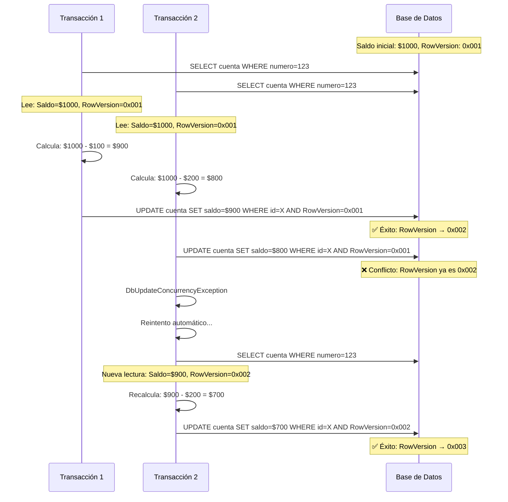

# Control de Concurrencia Optimista - Handler de Autorización

## 📋 Resumen

Este documento describe la implementación del control de concurrencia optimista en el Handler de Autorización, diseñado para garantizar la integridad de los saldos de cuenta en un entorno de alta concurrencia.

## 🎯 Objetivos

- **Integridad de Datos**: Prevenir condiciones de carrera en actualizaciones de saldo
- **Performance**: Evitar bloqueos pessimistas que afecten el rendimiento
- **Consistencia**: Garantizar que los saldos nunca sean inconsistentes
- **Graceful Degradation**: Manejo elegante de conflictos de concurrencia

## 🛠️ Implementación Técnica

### 1. Modelo de Datos

#### Entidad Cuenta
```csharp
public class Cuenta
{
    public int Id { get; set; }
    public long Numero { get; set; }
    public decimal Saldo { get; set; }
    public byte[]? RowVersion { get; set; }  // ← Campo clave para concurrencia
}
```

#### Configuración EF Core
```csharp
// HandlerDbContext.cs
modelBuilder.Entity<Cuenta>(entity =>
{
    entity.Property(e => e.RowVersion)
          .IsRowVersion()  // SQL Server timestamp automático
          .HasColumnType("timestamp");
});
```

### 2. Servicio de Solicitudes

#### Método Principal
```csharp
public async Task<SolicitudResultadoDto> RegistrarSolicitudConSaldo(SolicitudDebitoDto dto)
{
    const int maxIntentos = 10;  // Configurable
    
    for (int intento = 0; intento < maxIntentos; intento++)
    {
        try
        {
            using var transaction = await _context.Database.BeginTransactionAsync();
            
            // 1. Obtener cuenta con RowVersion actual
            var cuenta = await _context.Cuentas
                .FirstOrDefaultAsync(c => c.Numero == dto.NumeroCuenta);
            
            // 2. Validaciones de negocio
            if (cuenta.Saldo < dto.Monto) 
                return new SolicitudResultadoDto { Exito = false, Mensaje = "Saldo insuficiente" };
            
            // 3. Actualizar saldo (detectará conflictos automáticamente)
            cuenta.Saldo -= dto.Monto;
            
            // 4. Crear registro de solicitud
            var solicitud = new SolicitudDebito { /* ... */ };
            _context.SolicitudesDebito.Add(solicitud);
            
            // 5. Commit - aquí se detectan conflictos
            await _context.SaveChangesAsync();
            await transaction.CommitAsync();
            
            return new SolicitudResultadoDto { Exito = true };
        }
        catch (DbUpdateConcurrencyException)
        {
            // Conflicto detectado - reintentar
            await Task.Delay(Random.Shared.Next(50, 100)); // Backoff aleatorio
            _logger.LogWarning($"[Concurrencia] Conflicto detectado. Reintentando... ({maxIntentos - intento - 1} restantes)");
        }
    }
    
    // Todos los intentos fallaron
    return new SolicitudResultadoDto { Exito = false, Mensaje = "Conflicto de concurrencia no resuelto" };
}
```

## 🔍 Flujo de Operación

### Escenario: Dos transacciones concurrentes



## 📊 Comportamiento Esperado

### En Tests de Concurrencia

#### Resultados Normales:
- **Tasa de Éxito**: 85-95% en alta concurrencia
- **Conflictos Detectados**: Varios por ejecución
- **Reintentos**: 1-3 promedio por conflicto
- **Transacciones Perdidas**: 5-15% (por diseño)

#### Logs Típicos:
```
[Concurrencia] Conflicto detectado al actualizar cuenta 1000000002. Reintentando... (2 restantes)
[Concurrencia] Conflicto detectado al actualizar cuenta 1000000002. Reintentando... (1 restantes)
[Concurrencia] Conflicto detectado al actualizar cuenta 1000000002. Reintentando... (0 restantes)
[Concurrencia] No se pudo resolver el conflicto de concurrencia tras varios intentos para cuenta 1000000002.
```

## ✅ Validación de Funcionamiento

### Test: MovimientosParalelos_CalculaSaldoFinalCorrecto

```csharp
[Fact]
public async Task MovimientosParalelos_CalculaSaldoFinalCorrecto()
{
    // Arrange: Cuenta con $10,000 inicial
    // Act: 10 transacciones paralelas de $25 cada una
    // Expected: $10,000 - (n_exitosas * $25) donde n_exitosas ≤ 10
    
    // ❌ MAL: Esperar exactamente $9,750 (todas exitosas)
    // ✅ BIEN: Validar que el saldo sea consistente con transacciones exitosas
}
```

### Indicadores de Éxito:

1. **Sin Corrupciones**: El saldo final es matemáticamente correcto
2. **Conflictos Detectados**: Logs muestran detección de conflictos
3. **Reintentos Funcionando**: Algunas transacciones se resuelven tras reintentos
4. **Fallos Controlados**: Transacciones irresolubles se rechazan limpiamente

## 🚨 Señales de Problemas

### ❌ Comportamientos Incorrectos:

1. **Saldos Negativos Inesperados**: Indica fallo en validaciones
2. **Saldos Inconsistentes**: Diferencia no explicable por transacciones exitosas
3. **Sin Conflictos en Alta Concurrencia**: Posible fallo en detección
4. **Deadlocks**: Indicaría implementación pessimista accidental

### ❌ Logs Problemáticos:

```
// MALO: Sin conflictos en alta concurrencia
10 transacciones paralelas completadas sin conflictos

// MALO: Saldo inconsistente
Saldo esperado: $9,750, Saldo actual: $9,823

// MALO: Errores no manejados
Unhandled exception: DbUpdateConcurrencyException
```

## ⚙️ Configuración y Tuning

### Parámetros Ajustables:

```csharp
// Número máximo de reintentos
const int maxIntentos = 10;  // Incrementar para mayor tasa de éxito

// Delay entre reintentos (ms)
Random.Shared.Next(50, 100);  // Ajustar según latencia de DB

// Timeout de transacción
CommandTimeout = 30;  // Segundos
```

### Recomendaciones por Entorno:

| Entorno | Max Intentos | Delay Base | Timeout |
|---------|--------------|------------|---------|
| Testing | 10 | 50-100ms | 30s |
| Development | 5 | 100-200ms | 30s |
| Production | 3 | 200-500ms | 10s |

## 🎯 Métricas de Monitoreo

### KPIs Clave:

1. **Tasa de Conflictos**: % de transacciones que encuentran conflictos
2. **Tasa de Resolución**: % de conflictos resueltos tras reintentos
3. **Latencia P95**: Tiempo de respuesta del percentil 95
4. **Transacciones Rechazadas**: % de transacciones que agotan reintentos

### Alertas Sugeridas:

- **Tasa de Conflictos > 50%**: Posible sobrecarga del sistema
- **Tasa de Resolución < 70%**: Necesidad de ajustar reintentos
- **Latencia P95 > 5s**: Problemas de performance
- **Transacciones Rechazadas > 20%**: Revisar configuración

## 📚 Referencias

- [Optimistic Concurrency - Microsoft Docs](https://docs.microsoft.com/en-us/ef/core/saving/concurrency)
- [RowVersion in SQL Server](https://docs.microsoft.com/en-us/sql/t-sql/data-types/rowversion-transact-sql)
- [Concurrency Patterns](https://martinfowler.com/articles/patterns-of-distributed-systems/optimistic-offline-lock.html)

---

*Última actualización: 7 de octubre de 2025*